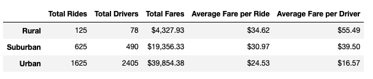
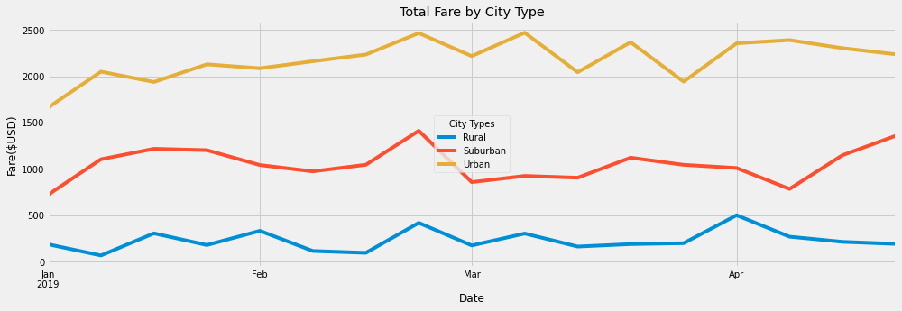

# PyBer_Analysis

## Overview

Pyber is a Python based ride-sharing app company. As the data analyst for the company, we are tasked to perform an exploratory analysis on two large datasets.

The datasets are two csv files: One is a city-data which describe the number of drivers in each city and the type of that city. Briefly, each city is categorized to one of three city types which are Urban, Suburban and Rural. The second file is a ride-data that lists rider-id, date, city, and fare amount for each ride taken. 

The two objectives for this report are to create a ride-sharing summary showing key matrics for each city type, and to create a multiple-line graph representation that shows the total weekly fares for each city type. The analysis should provide insights on improving access to ride-sharing services and to help suggest appropriate recommendation to the CEO

## Result

### A ride-sharing summary DataFrame by city type
we created a Pyber summary dataframe outlining the total rides, total drivers, total fares, average fare per ride, and average fare per driver for each city types.

There are several key technical steps involved to derive the summary. Firstly, we merged the city-data onto the ride-data using left join on the "city" column. Subsequently, we applied Pandas ***groupby()*** function to aggregate the "type" of cities and to obtain the desired sums and average totals. Lastly, we combined all the results onto one summary dataframe for a better representation.

 
 
From the data summary, we observed a substantial difference in the total rides, total driver counts, and total fares for the city types, especially between Urban and Rural cities. The numbers then greatly impacted the average fare per ride and average fare per driver.

 Below are some of the key findings and comparisons revealed: 

 - Urban cities have the highest total number of rides (1625); Rural cities have the lowest total number of rides (125)
    - Urban cities have 13 times more total rides than Rural cities.
        

 - Urban cities have the highest total number of drivers (2405); Rural cities have the lowest total number of drivers (78)
    - Urban cities have approximately 31 times more drivers than rural cities.

 - Urban cities have the highest sum of total fares ($39854.38); Rural cities have the lowest sum of total fares ($4327.93)
    - Urban cities have approximately 9 times more total fares than rural cities.

 - The average fare per ride is the highest in Rural cities ($34.62) and lowest in Urban cities ($24.53)
    - The average fare per ride in Rural cities is approximately 1.4 times higher comparing to urban cities.

 - The average fare per driver is the highest in Rural cities ($55.49) and lowest in Urban cities ($16.57)
    - The average fare per driver in Rural cities is approximately 3.4 times higher comparing to urban cities.

### A multiple-line chart of total fares for each city type

Second part of our analysis is to create a multiple-line chart using Matplotlib library on the datasets.

For this part of the analysis, we first applied ***groupby()*** function to aggregate "type" and "date" columns to calculate the sum of fares for each group. From there, we applied Pandas ***pivot()*** function to create a pivot table where we re-assembled the dataframe with "date" as the index and "type" (city type) as columns, and showing the "sum of fares" as values for the table. Then, we used Pandas ***loc()*** function to filter the pivot table dataframe with a desired date range (2019-01-01 to 2019-04-29). Next, we applied the Pandas ***resample()*** function with ('w') to aggregate the dates into weeks in order to create a new dataframe that have the sum of fares for each week. Lastly, we plotted the dataframe to a multiple-line chart using the Pandas and Matplotlib ***df.plot()*** function with appropriate formatting and annotation.

As shown in the multiple-line graph. From January to April 2019:

  - Urban cities that is marked in yellow have the highest weekly total fares, followed by Suburban cities that is marked in red. Rural cities on the other hand have the lowest weekly total fares, which is marked in blue. This would reflect that Pyber would gain more revenue from urban cities than Suburban and Rural cities.

- the three lines did not intersect at all. They all remained relatively straight and constant without too much volatility. Referring back to our first analysis, the drastic difference in total fares between the city types was due to their different total number of rides and total number of drivers. Rural cities have way less rides and drivers compared to urban cities and suburban cities which lead to less total fares.
    
- For all three city types, there is a small peak in total fares around mid-Feburary, followed by a decline at the end of Feburary. 

## Summary:

We could make three possible recommendations to the CEO based on our analysis:

1) While Urban cities make much more in total fares, the average fare per driver is actually way less in Urban Cities comparing to Rural areas. Recall back to the first analysis, the average fare per driver in Rural cities is approximately 3.4 times higher comparing to Urban cities. In other words, Rural rides are much more profitable. Therefore, I recommend to reduce the number of drivers in Urban cities and allocate more drivers to Rural cities.

2) Based on the total number of rides from the city types, there is a much higher demand in Urban cities compared to Suburban and Rural cities. I suggest to increase the base fare in Urban cities. Currently the average fare per ride in Urban cities are the cheapest, at $24.53. It could be raised with respect to its high demand and to generate more revenue for Pyber and for the drivers.

3) From the multi-line graph we are seeing a small increase in total fares for all city types in mid-Feb, followed by a decline. I suggest to gather more data if possible and start a new project to explore the underlying cause for the increase in total fares. 

